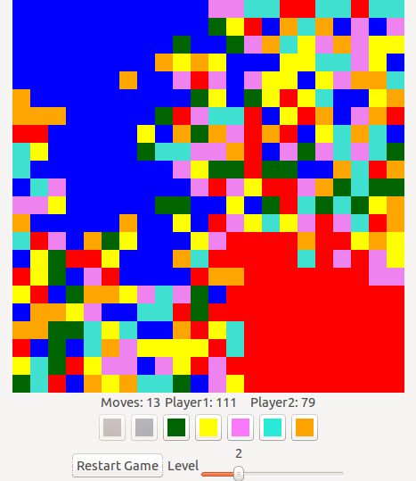

# Color Flood

This game is based on [Color Flood by WetPalm](https://play.google.com/store/apps/details?id=com.wetpalm.colorflood),
itself based on [Flood-It! by LabPixies](https://play.google.com/store/apps/details?id=com.labpixies.flood) (as far as I can tell).
This game has been [shown to be NP-hard](http://arxiv.org/abs/1001.4420), and is thus non-trivial ;)

Install it with:
```
$ raco pkg install color-flood
```
or via DrRacket `File/Install package`.

Start it with:
```
$ racket -l color-flood
```
or in DrRacket, click on `File/Open require path` and enter `color-flood/main.rkt`. Then run the file.





